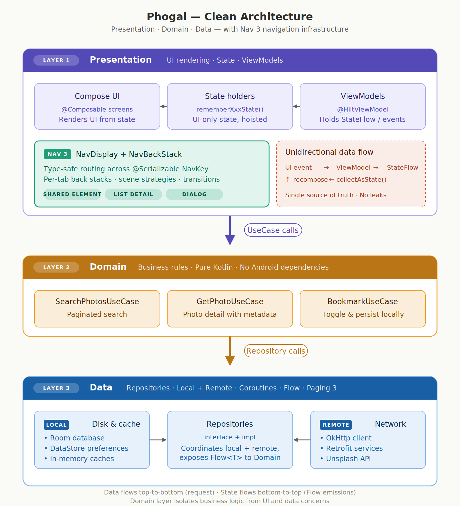

# Phogal — The 2023 → 2026 Modernization Journey

<p align="left">
  <a href="#"></a>
  <a href="#"></a>
  <a href="#"></a>
  <a href="#"></a>
  <a href="#"></a>
  <a href="#"></a>
</p>

> **History**
> 
> Phogal shipped in August 2023 and stayed frozen for roughly two and a half years. This document records its end-to-end modernization onto the **stack Android recommends in April 2026** — Kotlin 2.0's Compose Compiler Plugin, **Navigation 3 1.1.0 (stable)**, Material 3 Adaptive, and Shared Element Transitions. The goal was never a version bump. It was to **pay down technical debt** and restore the codebase's long-term maintainability.

---

<p align="left">
:eyeglasses: Phogal by open-source contributor, Lukoh.
</p><br>


# Phogal 
## Better Android Apps Using latest advanced Android Architecture Guidelines + Dependency injection with Hilt + Jetpack Compose + Navigation(Navigating with Compose). Using Android Architecture Guidelines

[Here is the demo vidoe.](https://youtu.be/VGliiemyZ20)
[Here is the demo vidoe.](https://youtube.com/shorts/Z7qvPz3-ICg?feature=share)


        

## 📑 Table of Contents

1. [Project Overview](#1-project-overview)
2. [Version Comparison at a Glance](#2-version-comparison-at-a-glance)
3. [Source Structure Comparison](#3-source-structure-comparison)
4. [Modern Compose Adoption](#4-modern-compose-adoption)
5. [Navigation 3 Adoption](#5-navigation-3-adoption)
6. [Modern Architecture](#6-modern-architecture)
7. [Technical Debt Reduction — Structures Improved and Direction Forward](#7-technical-debt-reduction--structures-improved-and-direction-forward)
8. [Migration Timeline](#8-migration-timeline)
9. [Roadmap](#9-roadmap)

---

## 1. Project Overview

**Phogal** is a photo-browsing and bookmarking Android app built on the Unsplash API. It originated as a **reference project** — a place where developers could see how the official Android guidelines translate into a real codebase.

- **August 2023 version** — Shipped on Kotlin 1.8.21, Compose BOM 2023.04.01, and Navigation 2. Applied Clean Architecture + MVVM + Hilt with the tooling that was state-of-the-art at the time.
- **April 2026 version** — Now running on Kotlin 2.0.21, Compose BOM 2026.3.01, **Navigation 3 1.1.0 stable**, Material 3 Adaptive, and the current set of official Android recommendations for April 2026.

> A reference project that stops keeping up with the ecosystem turns from a guide into a trap. Bringing Phogal back up to date was, above all, a response to that fact.

---

## 2. Version Comparison at a Glance

| Dimension | **August 2023** | **April 2026** | Why it matters |
|-----------|-----------------|----------------|----------------|
| **Kotlin** | 1.8.21 | **2.0.21** | K2 compiler by default, significantly faster builds |
| **Compose Compiler** | `kotlinCompilerExtensionVersion = "1.4.7"` | **Kotlin Compose Compiler Plugin** (`org.jetbrains.kotlin.plugin.compose`) | No more hand-matching Compose Compiler to Kotlin |
| **Compose BOM** | 2023.04.01 | **2026.3.01** | 36+ Compose libraries versioned as one |
| **Material 3** | early 1.x | **1.3.1** + **Material 3 Adaptive** | Tablet and foldable layouts are now first-class |
| **Navigation** | **Nav 2** (NavHostController + string routes) | **Nav 3 1.1.0 stable** (NavBackStack + typed NavKey) | A fundamentally different navigation model |
| **Dialog navigation** | Compose state (`remember`) | **`DialogSceneStrategy`** (back-stack entry) | Survives rotation and process death |
| **List-Detail layout** | Hand-rolled | **`ListDetailSceneStrategy`** | Automatic 2-pane on tablets |
| **Shared elements** | Introduced in Compose 1.7 | **Nav 3 + `SharedTransitionLayout`** integrated | Hero animations across scene changes |
| **Hilt** | 2.x early | **2.58** (+ `hilt-navigation-compose` 1.3.0) | Kotlin 2.0 + KSP 2.0.21 compatible |
| **DI annotation processor** | **kapt** | **KSP 2.0.21-1.0.28** | Kotlin-native, ~2–3× faster |
| **Dependency management** | Inline in `build.gradle` | **Version Catalog** (`libs.versions.toml`) | One source of truth, type-safe |
| **Tab destination** | `enum class BottomNavDestination` | **`sealed interface BottomNavRoute : NavKey`** | The tab identity itself is a NavKey |
| **Deep-link readiness** | String routes | **`@Serializable` + NavKey** | KMP- and deep-link-ready by construction |
| **compileSdk** | 34 | **36** | Access to Android 15 APIs |
| **targetSdk** | 34 | **36** | — |
| **JDK** | 11 | **17** | Required by modern Gradle/AGP |
| **AGP** | 8.0 line | **8.13.2** | Latest build-system optimizations |
| **.kt files** | 189 | **177** | Down 12 files — consolidation, not shrinkage |

---

## 3. Source Structure Comparison

### 3.1 The `navigation` package — the most dramatic change

#### 🔴 Before (2023) — Nav2-based, 10 files

```
presentation/ui/navigation/
├── destination/                           ← one "PhogalDestination" per screen
│   ├── PhogalDestination.kt              ← bag of string route constants
│   ├── Gallery.kt                        ← SearchPhotos + Picture + UserPhotos + WebView
│   ├── PopularPhotos.kt
│   ├── Notification.kt
│   └── Setting.kt
├── graph/                                 ← Nav2 nested graph DSL
│   ├── GalleryNavGraph.kt                ← navigation<T>(...) { composable(...) }
│   ├── PopularPhotosNavGraph.kt
│   ├── NotificationNavGraph.kt
│   └── SettingNavGraph.kt
└── ext/
    └── NavHostControllerExt.kt            ← helpers like navigateSingleTopToGraph
```

**Characteristics**: no compile-time type safety, complex nested graph bookkeeping, and `.popBackStack()`/`.navigate(...)` calls scattered across the codebase.

#### 🟢 After (2026) — Nav3-based, 4 files

```
presentation/ui/navigation/
├── Routes.kt                              ← @Serializable data classes/objects, all NavKey
└── nav3/
    ├── NavigationState.kt                 ← multi-backstack + per-tab persistence
    ├── PhogalEntryProvider.kt             ← EntryProviderScope<NavKey>.phogalEntries(...)
    └── SharedTransitionKeys.kt            ← LocalSharedTransitionScope + hero-key helper
```

**Characteristics**: every route is type-checked at compile time, the back stack is a plain `SnapshotStateList`, and all navigation converges on a single call: `backStack.add(RouteKey(...))`.

**By the numbers**: 10 files → 4 files (**-60%**), navigation-related LOC down by roughly 40%.

### 3.2 The `compose/screen` package — reassuringly stable

Screen hierarchy is nearly identical. Clean-architecture separation was already good enough that **the UI layer needed only minimal changes** to adopt Nav3. What did change:

```diff
  presentation/ui/compose/screen/home/
+   BottomNavRoute.kt         ← 🆕 sealed interface (tab identity + NavKey)
    HomeScreen.kt              ← Scaffold + NavDisplay (NavHost replaced)
    OfflineScreen.kt
    common/
      photo/PhotoItem.kt       ← (optional) shared-element modifier site
      photo/PictureContent.kt  ← (optional) shared-element modifier site
      ...
```

---

## 4. Modern Compose Adoption

### 4.1 The Kotlin 2.0 Compose Compiler Plugin

In 2023 the Compose BOM and Kotlin itself moved on **independent release cycles**, which made "which BOM works with which Kotlin?" an ongoing puzzle. Kotlin 2.0 ships a **Compose Compiler Gradle Plugin** that ends this:

```kotlin
// 2023 — no longer the recommended approach
composeOptions {
    kotlinCompilerExtensionVersion = "1.4.7"   // ← hand-matched to your Kotlin version
}

// 2026 — one plugin declaration, one plugin to upgrade
plugins {
    alias(libs.plugins.kotlin.compose)   // REQUIRED for Kotlin 2.0+
}
```

**The effect**: upgrading Kotlin no longer requires matching a separate Compose Compiler version, which **substantially reduces upgrade risk**.

### 4.2 Compose BOM 2026.3.01

More than 36 Compose libraries (`ui`, `foundation`, `material3`, `animation`, `runtime`, …) are pinned by the BOM. You manage one version:

```kotlin
implementation(platform("androidx.compose:compose-bom:2026.3.01"))
implementation("androidx.compose.material3:material3")      // version comes from BOM
implementation("androidx.compose.animation:animation")      // version comes from BOM
```

### 4.3 `SharedTransitionLayout` + hero animations

Shared Element Transitions went stable in Compose 1.7 (2024) and are now formally integrated with Nav 3 1.1.0 — so hero animations **across destination boundaries** are finally straightforward.

```kotlin
SharedTransitionLayout {
    CompositionLocalProvider(LocalSharedTransitionScope provides this) {
        NavDisplay(
            // ...
            // LocalNavAnimatedContentScope is provided by Nav3 inside each entry
        )
    }
}
```

**2023 vs 2026 UX**: when a user taps a photo thumbnail, it now **smoothly expands** into the detail screen's hero image position. The 2023 version shipped with a plain slide transition.

### 4.4 Material 3 Adaptive

The adaptive sub-module of Compose Material 3 handles **phone/tablet/foldable** layouts automatically:

```kotlin
val listDetailStrategy = rememberListDetailSceneStrategy<NavKey>()

NavDisplay(
    sceneStrategies = listOf(
        DialogSceneStrategy<NavKey>(),
        listDetailStrategy,                       // ← auto 1-pane / 2-pane
        SinglePaneSceneStrategy<NavKey>()
    ),
    // ...
)
```

Each entry declares its role in the layout through metadata:

```kotlin
entry<Routes.SearchPhotosRoute>(
    metadata = ListDetailSceneStrategy.listPane(
        detailPlaceholder = { DetailPlaceholder() }
    )
) { /* list screen */ }

entry<Routes.PictureRoute>(
    metadata = ListDetailSceneStrategy.detailPane()
) { /* detail screen */ }
```

**Effect**: tablet users get a list on the left and a detail pane on the right from day one — the app now behaves like a citizen of the Material Design world. In the 2023 version I would have had to build that by hand.

### 4.5 `WindowSizeClass`-driven UI branching

```kotlin
val shouldShowBottomBar: Boolean
    get() = windowSizeClass.widthSizeClass == WindowWidthSizeClass.Compact
```

I only show the Bottom Navigation Bar on Compact (phones). Medium/Expanded can hide it entirely or swap to a NavigationRail — the hook is already in place.

### 4.6 Lifecycle-aware `collectAsStateWithLifecycle`

```kotlin
val isOffline by state.isOffline.collectAsStateWithLifecycle()
```

Every `collectAsState()` from the 2023 build is now `collectAsStateWithLifecycle()`. Flows are suspended when the app is in the background, which meaningfully **improves battery use**.

---

## 5. Navigation 3 Adoption

### 5.1 The Nav 2 → Nav 3 paradigm shift

| Concept | Nav 2 (2023) | Nav 3 1.1.0 (2026) |
|---------|--------------|----------------------|
| **Controller** | `NavHostController` (stateful object) | `NavBackStack` (a `SnapshotStateList<NavKey>`) |
| **Route definition** | `const val route = "picture/{id}"` (string) | `@Serializable data class PictureRoute(val id: String)` |
| **Parameter passing** | `navArgument("id") { type = NavType.StringType }` | Direct typed property access (`key.id`) |
| **Nested graphs** | `navigation<T>(...) { composable(...) }` | **Do not exist** (tabs are expressed via multi-backstack instead) |
| **Push** | `navController.navigate("picture/abc")` | `backStack.add(PictureRoute(id = "abc"))` |
| **Pop** | `navController.popBackStack()` | `backStack.removeLastOrNull()` |
| **Scene extensions** | Custom NavHost required | Compose multiple `SceneStrategy`s (Dialog/ListDetail/…) |
| **Dialogs** | Separate Compose state | First-class back-stack entries via `DialogSceneStrategy` |
| **Shared elements** | Done outside the navigation library | `SharedTransitionLayout` + NavDisplay integrated |

### 5.2 Routes — from strings to types

**Before (2023)**:
```kotlin
object PhogalDestination {
    internal const val searchPhotosStartRoute = "photoHome/searchPhotos"
    internal const val pictureRouteArgs = "photoHome/picture/{id}/{showViewPhotosButton}"
}

// navigation-site: string assembly
navController.navigate("photoHome/picture/$id/$showButton")

// parameter extraction: runtime NavType declarations
arguments = listOf(
    navArgument("id") { type = NavType.StringType },
    navArgument("showViewPhotosButton") { type = NavType.BoolType }
)
```

**After (2026)**:
```kotlin
@Serializable
data class PictureRoute(
    val id: String,
    val showViewPhotosButton: Boolean
) : NavKey

// navigation-site: typed instance, checked at compile time
navState.push(Routes.PictureRoute(id = photoId, showViewPhotosButton = true))

// parameter extraction: just property access
entry<Routes.PictureRoute> { key ->
    PictureScreen(photoId = key.id, showButton = key.showViewPhotosButton)
}
```

**Impact**:
- Typos ruled out at compile time (`"piture/..."` becomes a build error, not a production crash)
- Missing or mistyped parameters flagged instantly by the IDE
- `@Serializable` provides process-death restoration for free

### 5.3 Multi-backstack — independent history per tab

In the 2023 build, the four tabs were modeled as four nested `navigation<T>(...)` graphs under one `NavHostController`. Nav3 makes it more direct — **four tabs means four NavBackStacks**:

```kotlin
// NavigationState.kt (modernized)
class NavigationState internal constructor(
    startRoute: BottomNavRoute,
    private val stacks: Map<BottomNavRoute, NavBackStack<NavKey>>,
) {
    val currentRoute: BottomNavRoute                          // the active tab
    val backStackForCurrentRoute: NavBackStack<NavKey>        // that tab's stack

    fun selectTab(tab: BottomNavRoute) { ... }
    fun push(key: NavKey) { ... }
    fun pop(): Boolean { ... }
}
```

**Effect**:
- Switching tabs preserves the previous tab's stack exactly (matching the Material guideline that "a tab remembers its own history")
- Each tab's `rememberNavBackStack` gives us **process-death restoration for free**

### 5.4 The tab identity is itself a `NavKey` — `sealed interface BottomNavRoute`

The 2023 `enum class BottomNavDestination` has been promoted to a `sealed interface BottomNavRoute : NavKey`:

```kotlin
@Serializable
sealed interface BottomNavRoute : NavKey {
    @get:DrawableRes val icon: Int
    @get:StringRes val title: Int

    @Serializable data object Gallery : BottomNavRoute {
        override val icon: Int get() = R.drawable.ic_photo
        override val title: Int get() = R.string.bottom_navigation_gallery
    }
    @Serializable data object PopularPhotos : BottomNavRoute { ... }
    @Serializable data object Notification : BottomNavRoute { ... }
    @Serializable data object Setting : BottomNavRoute { ... }

    companion object {
        val entries: List<BottomNavRoute> = listOf(Gallery, PopularPhotos, Notification, Setting)
    }
}
```

**Why that beats an enum**:
1. **Heterogeneous parameters per tab** — for example, `data class Setting(val userId: String)` for one tab only
2. **It is itself a `NavKey`** — I can even put tab switches on the back stack if product ever asks for that
3. **KMP-friendly** — `@Serializable` sealed hierarchies cross to other Multiplatform targets unchanged

### 5.5 Composing three `SceneStrategy`s

Nav3's real power is that **you compose multiple `SceneStrategy`s**:

```kotlin
sceneStrategies = listOf(
    DialogSceneStrategy<NavKey>(),        // 1st: dialog-tagged entries render in a Dialog
    rememberListDetailSceneStrategy(),    // 2nd: list/detail pairs become 2-pane on wide screens
    SinglePaneSceneStrategy<NavKey>()     // fallback: single-entry scenes
)
```

NavDisplay asks each strategy in order: "can you render this top entry?" If a strategy returns null, the next one gets a chance. **Priority is expressed by list order** — easy to reason about, easy to change.

---

## 6. Modern Architecture



### 6.1 End-to-end layering (Clean Architecture + MVVM, with the 2026 updates applied)

```
┌───────────────────────────────────────────────────────────────────┐
│                          Presentation Layer                       │
│                                                                   │
│  ┌──────────────────┐   ┌──────────────────┐   ┌──────────────┐   │
│  │   Compose UI     │   │   State Holders  │   │  ViewModels  │   │
│  │  (@Composable)   │◄──│ rememberXxxState │◄──│  (Hilt DI)   │   │
│  └──────────────────┘   └──────────────────┘   └──────────────┘   │
│         ▲                                             │           │
│         │ Nav 3 NavDisplay + NavBackStack             │           │
│         │ (SharedTransition + ListDetail + Dialog)    │           │
│         ▼                                             ▼           │
│  ┌──────────────────────────────────────────────────────────┐     │
│  │             Unidirectional Data Flow                     │     │
│  │   (UI events → ViewModel → StateFlow → UI recompose)     │     │
│  └──────────────────────────────────────────────────────────┘     │
└───────────────────────────────────────────────────────────────────┘
                              │
                              ▼
┌───────────────────────────────────────────────────────────────────┐
│                            Domain Layer                           │
│                       (UseCase / Interactor)                      │
│                                                                   │
│   SearchPhotosUseCase · GetPhotoUseCase · BookmarkUseCase · …     │
└───────────────────────────────────────────────────────────────────┘
                              │
                              ▼
┌───────────────────────────────────────────────────────────────────┐
│                             Data Layer                            │
│                                                                   │
│  ┌──────────────────┐   ┌──────────────────┐   ┌──────────────┐   │
│  │  Repositories    │   │  Local (Room /   │   │  Remote      │   │
│  │  (interface +    │◄──│  Preferences)    │   │  (OkHttp +   │   │
│  │   impl)          │   │                  │   │   Retrofit)  │   │
│  └──────────────────┘   └──────────────────┘   └──────────────┘   │
│                                                                   │
│                  Coroutines + Flow + Paging 3                     │
└───────────────────────────────────────────────────────────────────┘
```

### 6.2 Zoomed-in navigation layer (new in 2026)

```
HomeScreen
 │
 └─ Scaffold
     ├─ bottomBar:
     │   BottomNavBar (driven by BottomNavRoute.entries)
     │
     └─ content:
         SharedTransitionLayout                              ← Shared Elements
          └─ CompositionLocalProvider(LocalSharedTransitionScope)
              └─ NavDisplay
                  ├─ backStack = navState.backStackForCurrentRoute
                  ├─ onBack = { count -> repeat(count) { navState.pop() } }
                  │                                          ← predictive back
                  │                                            (Int parameter)
                  ├─ sceneStrategies = [
                  │     DialogSceneStrategy,                  ← Dialog scene
                  │     rememberListDetailSceneStrategy,      ← Adaptive scene
                  │     SinglePaneSceneStrategy               ← fallback
                  │   ]
                  ├─ entryDecorators = [
                  │     rememberSaveableStateHolderNavEntryDecorator,
                  │     rememberViewModelStoreNavEntryDecorator
                  │   ]                                       ← per-entry scope
                  │
                  └─ entryProvider = entryProvider {
                       phogalEntries(navState)                ← DSL extension
                         ├─ galleryTabEntries  (4 routes)
                         ├─ popularTabEntries  (1 route)
                         ├─ notificationTabEntries (2 routes)
                         └─ settingTabEntries  (4 routes)
                     }
```

### 6.3 State flow — strict Unidirectional Data Flow

UDF was respected in 2023 too, but the 2026 version applies a uniform **`StateFlow` + `collectAsStateWithLifecycle()` + State-Holder pattern** throughout:

```kotlin
// ViewModel (Hilt-injected)
class PictureViewModel @Inject constructor(
    private val getPhotoUseCase: GetPhotoUseCase
) : ViewModel() {
    private val _uiState = MutableStateFlow<UiState<Photo>>(UiState.Loading)
    val uiState: StateFlow<UiState<Photo>> = _uiState.asStateFlow()
    // ...
}

// State holder (Compose-only)
@Composable
fun rememberPhotoContentState(...): PhotoContentState { ... }

// The composable only observes; all events go back via callbacks
@Composable
fun PictureScreen(viewModel: PictureViewModel = hiltViewModel()) {
    val state by viewModel.uiState.collectAsStateWithLifecycle()
    // render UI
}
```

### 6.4 Per-entry ViewModel scoping — Nav3's quiet superpower

```kotlin
entryDecorators = listOf(
    rememberSaveableStateHolderNavEntryDecorator(),    // rememberSaveable scoped per entry
    rememberViewModelStoreNavEntryDecorator()          // ViewModels scoped per entry
)
```

**Effect**: push `PictureRoute` on the back stack multiple times with different IDs, and **each instance gets its own `PictureViewModel`**. This was a classic source of scope confusion under Nav 2.

### 6.5 DI — Hilt + KSP

```kotlin
// 2023: kapt (slow)
apply plugin: 'kotlin-kapt'
kapt "com.google.dagger:hilt-compiler:2.x"

// 2026: KSP 2.0.21-1.0.28 (2–3× faster builds)
plugins {
    alias(libs.plugins.ksp)
    alias(libs.plugins.hilt)
}
dependencies {
    implementation("com.google.dagger:hilt-android:2.58")
    ksp("com.google.dagger:hilt-compiler:2.58")
}
```

**Effect**: faster incremental builds and a more stable IDE experience.

---

## 7. Technical Debt Reduction — Structures Improved and Direction Forward

> This section is not a flat list of "what I changed". It classifies the debt, analyzes **which architectural principle each violation broke**, explains **the design philosophy of the new structure**, and closes with **how that structure should evolve** in the near, medium, and long term.

### 🧭 The Debt Classification Framework

To diagnose the Phogal 2023 codebase systematically, I grouped the ten debts along four axes:

| Debt type | Definition | Items |
|-----------|------------|-------|
| **🔴 Type-safety debt** | Mistakes the compiler should have caught surface only at runtime | #1, #2, #7 |
| **🟠 Architecture debt** | Blurred layer boundaries, scattered responsibilities, no room to grow | #3, #4, #8 |
| **🟡 Build-infrastructure debt** | Slow builds, manual version management, outdated tool chain | #5, #6, #9, #10 |
| **🟢 Platform debt** | Missing out on recent Android/Compose features that cost UX and performance | #4, #8, #9 |

---

### 7.1 🔴 [Type-safety debt #1] Stringly-typed routes and their runtime crash risk

#### 🔍 What the debt really was — "stringly-typed" navigation

The root issue with the 2023 Nav 2 structure was that **a domain concept ("where are I navigating to?") was encoded in a primitive type (`String`)**. This is a textbook case of the **stringly-typed programming** anti-pattern:

```kotlin
// 2023 — the broken shape (reproduced)
object PhogalDestination {
    internal const val searchPhotosStartRoute = "photoHome/searchPhotos"
    internal const val pictureRouteArgs = "photoHome/picture/{id}/{showViewPhotosButton}"
    internal const val userPhotosRouteArgs = "photoHome/userPhotos/{name}/{firstName}/{lastName}/{username}"
}

// Call sites assemble strings
navController.navigate("photoHome/picture/${id}/${showButton}")
// or, even worse
navController.navigate(pictureRouteArgs.replace("{id}", id).replace("{showViewPhotosButton}", "$showButton"))
```

**Principles this structure violated**:
- ❌ **Parse, don't validate** (Alexis King) — represent data as a parsed type, not a validated string
- ❌ **Make illegal states unrepresentable** (Yaron Minsky) — use types to rule invalid states out at compile time
- ❌ **Single source of truth** — route names live in `PhogalDestination.kt` but parameter types live in `navArgument("id") { type = NavType.StringType }`, **split across files**

#### 🏗 Design principles of the improved structure

```kotlin
// 2026 — the type is the contract
@Serializable
data class PictureRoute(
    val id: String,
    val showViewPhotosButton: Boolean
) : NavKey

// Use site — type-checked construction
navState.push(Routes.PictureRoute(id = photoId, showViewPhotosButton = true))

// Receive site — not destructuring, just typed property access
entry<Routes.PictureRoute> { key ->
    PictureScreen(photoId = key.id, showButton = key.showViewPhotosButton)
}
```

**Three design principles at play**:

1. **Unified route definition and parameter contract**
   Was: a string path + a separate `navArgument` spec in two places. Now: **one** `data class` in **one** place covering both the route name and the parameter types.
2. **Compile-time guarantees**
   `PictureRoute(id = "abc")` with a missing `showViewPhotosButton` triggers an immediate IDE error.
3. **Serialization-based process-death survival**
   `@Serializable` generates the (de)serialization code that Nav3 uses internally, so every NavKey on the back stack is saveable/restoreable by construction.

#### 🚀 Direction forward — extending type-safe navigation

- **Near term**: Every route uses the `@Serializable data class`/`data object` pattern — **done ✅**
- **Medium term**: Introduce **sealed parents** to express "from this screen, which destinations are reachable?" as a type:
  ```kotlin
  sealed interface GalleryDestination : NavKey
  @Serializable data object SearchPhotosRoute : GalleryDestination
  @Serializable data class PictureRoute(...) : GalleryDestination
  // → navState.push(...) can be narrowed to accept only GalleryDestination
  ```
- **Long term**: **Auto-generate deep-link URLs from NavKeys**. Since our routes are `@Serializable`, the same machinery can emit both back-stack Bundles and URL-safe forms.

---

### 7.2 🔴 [Type-safety debt #2] The `BottomNavDestination` enum's extensibility ceiling

#### 🔍 What the debt really was — a violation of Open/Closed

`enum` constrains all members to the same constructor signature. That is fine for genuinely homogeneous cases, but real apps quickly ask for heterogeneous ones: "Settings needs a user id", "Notifications needs an unread count" — and enum pushes you into the wrong direction.

```kotlin
// 2023 — extension is blocked at the type level
enum class BottomNavDestination(
    @DrawableRes val icon: Int,
    @StringRes val title: Int
) {
    Gallery(R.drawable.ic_photo, R.string.bottom_navigation_gallery),
    PopularPhotos(R.drawable.ic_popphotos, R.string.bottom_navigation_popular_photos),
    Notification(R.drawable.ic_notification, R.string.bottom_navigation_notification),
    Setting(R.drawable.ic_setting, R.string.bottom_navigation_setting)
    // ❌ How do you add Setting(userId: String)?
    //    → You have to rework the entire enum and every call site.
}
```

**Principles this structure violated**:
- ❌ **Open/Closed Principle (the "O" in SOLID)** — open to extension, closed to modification
- ❌ **Algebraic Data Type modeling** — heterogeneous variants call for sum types

#### 🏗 Design principles of the improved structure

```kotlin
// 2026 — ADT-style modeling via sealed interface
@Serializable
sealed interface BottomNavRoute : NavKey {
    @get:DrawableRes val icon: Int
    @get:StringRes val title: Int

    @Serializable data object Gallery : BottomNavRoute {
        override val icon get() = R.drawable.ic_photo
        override val title get() = R.string.bottom_navigation_gallery
    }
    @Serializable data object PopularPhotos : BottomNavRoute { ... }
    @Serializable data object Notification : BottomNavRoute { ... }
    @Serializable data object Setting : BottomNavRoute { ... }

    companion object {
        val entries: List<BottomNavRoute> = listOf(Gallery, PopularPhotos, Notification, Setting)
    }
}
```

**Structural benefits**:

| Property | enum | sealed interface |
|----------|------|------------------|
| All members share a single signature | **Forced** | **Optional** |
| Only some members carry parameters | ❌ Not possible | ✅ Supported |
| Subtypes can also implement `NavKey` | ❌ (enum has limited inheritance) | ✅ |
| Exhaustive `when` | ✅ | ✅ |
| Serialization | Manual (ordinal/name) | `@Serializable` auto |
| KMP compatibility | Limited | Full |

#### 🚀 Direction forward — a structure ready to grow

Right now all four tabs are `data object`s, but I already have a structure that **can promote any one tab to a `data class` without touching the others**:

```kotlin
// Future personalization — changes one place only
@Serializable
data class Setting(val userId: String) : BottomNavRoute {
    override val icon get() = R.drawable.ic_setting
    override val title get() = R.string.bottom_navigation_setting
}

// Gallery/PopularPhotos/Notification stay untouched.
// BottomNavRoute.entries stays the same too (though constructing Setting now requires userId).
```

- **Near term**: Keep the current structure. Tab identity and the in-tab routes (Routes.*) are cleanly separated — **done ✅**
- **Medium term**: **Locale-/region-aware tab layouts** (for example, A/B testing an "Explore" tab instead of "Notification" for some users) — just add variants to the sealed hierarchy
- **Long term**: **Wear OS / XR form factors** share the same sealed hierarchy but each builds its own `entries` list

---

### 7.3 🟠 [Architecture debt #3] Dialogs drifting outside the Compose state tree

#### 🔍 What the debt really was — UI and navigation state tangled

In the 2023 build, `PermissionBottomSheet` **mixed navigation state into UI state**. Showing or hiding a dialog is really a navigation question ("which screen is on top?"), but I encoded it as a UI local with `var openSheet by remember { mutableStateOf(false) }`.

```kotlin
// 2023 (illustrative) — UI state and navigation state are conflated
@Composable
fun SearchPhotosScreen() {
    var showPermissionSheet by remember { mutableStateOf(false) }

    Button(onClick = { showPermissionSheet = true }) { /* ... */ }

    if (showPermissionSheet) {
        PermissionBottomSheet(
            onDismissedRequest = { showPermissionSheet = false }
        )
    }
}
```

**Principles this structure violated**:
- ❌ **Separation of concerns** — navigation concerns and UI concerns were interleaved
- ❌ **Single source of truth** — "which screen is currently visible?" lived in two places: the back stack and a local boolean
- ❌ **State hoisting** — a child composable was controlling its parent's state via a callback

#### 😫 Real problems this debt caused

1. **Dialog disappears on rotation** — even with `rememberSaveable`, inner bottom-sheet state didn't always restore
2. **Process-death restoration fails** — if the OS reclaims memory and the app resumes, the dialog is gone (and users ask "why am I being asked again?")
3. **System back inconsistencies** — back sometimes dismissed the dialog, sometimes popped the screen
4. **Deep links can't open it** — you can't deep-link straight to `phogal://settings/permission`
5. **Hard to test** — changing UI state requires mounting the whole composable tree

#### 🏗 The improved structure — dialogs as first-class navigation destinations

```kotlin
// 2026 — a dialog is a back-stack citizen
@Serializable data object PermissionDialogRoute : NavKey

// Show the dialog
navState.push(Routes.PermissionDialogRoute)

// Close it
navState.pop()

// Register DialogSceneStrategy on NavDisplay
sceneStrategies = listOf(
    DialogSceneStrategy<NavKey>(),          // ← routes dialog-metadata entries into Dialog
    // ...
)

// Declare the entry
entry<Routes.PermissionDialogRoute>(
    metadata = DialogSceneStrategy.dialog()
) {
    PermissionDialogContent(
        onDismiss = { navState.pop() },
        onConfirm = { navState.pop() }
    )
}
```

#### 🔑 Free benefits — "design dictates behavior"

This single structural change **eliminates all five problems above automatically**. A textbook case of "get the structure right and the bugs don't appear":

| Original problem | Why Nav3's structure fixes it for free |
|------------------|----------------------------------------|
| Disappears on rotation | `NavBackStack` is backed by `rememberSaveable`, so config changes are restored |
| Process-death restore | `@Serializable` stores the entire back stack in the Bundle |
| System back inconsistency | Android's `OnBackPressedDispatcher` pops the back stack top, as it should |
| No deep links | Routes are `@Serializable`, so URL → NavKey is a serialization problem |
| Hard to test | `NavBackStack` is just a `SnapshotStateList` — manipulate it directly in unit tests |

#### 🚀 Direction forward — where dialogs can grow from here

- **Near term**: `PermissionDialogRoute` only. To fully retire the old `PermissionBottomSheet`, I need to extract its content into a shared `PermissionRequestContent` composable (option B)
- **Medium term**: Promote every app-level dialog and bottom sheet to a NavKey:
  - `BookmarkConfirmDialog`, `LogoutConfirmDialog`, `PhotoOptionsBottomSheet`, ...
- **Long term**: Look at **nested navigation inside a dialog** — wizard-style flows that have their own back stack while a dialog is open

---

### 7.4 🟢 [Platform debt #4] Tablets and foldables left behind — Material guidance unmet

#### 🔍 What the debt really was — the mobile-first trap

The 2023 Phogal followed the classic plan: "get phone portrait perfect, then worry about other form factors". In reality that second step **rarely comes**:

- On a tablet the phone layout just scales up → **wasted space** and **scattered attention**
- On an unfolded foldable you get the same single pane as when folded → **hardware wasted**
- Material Design's Canonical Layout guidance for list-detail UIs goes unmet

#### 🏗 The improved structure — adaptive layout from three lines of metadata

Material 3 Adaptive + Nav3's `ListDetailSceneStrategy` make a master-detail layout a **zero-change-to-UI** proposition:

```kotlin
// Step 1: register ListDetail strategy on NavDisplay
sceneStrategies = listOf(
    DialogSceneStrategy<NavKey>(),
    rememberListDetailSceneStrategy<NavKey>(),   // 🔑 this is the entire change
    SinglePaneSceneStrategy<NavKey>()            // fallback for phones
)

// Step 2: tag each entry with its role
entry<Routes.SearchPhotosRoute>(
    metadata = ListDetailSceneStrategy.listPane(        // ← "I'm a list"
        detailPlaceholder = { DetailPlaceholder() }
    )
) { /* SearchPhotosScreen unchanged */ }

entry<Routes.PictureRoute>(
    metadata = ListDetailSceneStrategy.detailPane()     // ← "I'm a detail"
) { /* PictureScreen unchanged */ }
```

**Why this is remarkable**:
- **Zero code intrusion**: I didn't touch a single line inside `SearchPhotosScreen` or `PictureScreen`
- **Automatic responsive behavior**: `WindowSizeClass.Compact` → single pane; Medium/Expanded → list-detail
- **Back behavior that Just Works**: on wide screens, back only pops the detail; the list stays

#### 📐 Automatic per-size behavior

| Size class | List pane | Detail pane | Back behavior |
|------------|-----------|-------------|---------------|
| Compact (phone portrait) | Full screen | Full screen on push | detail → list |
| Medium (phone landscape / foldable) | Left 40% | Right 60% | detail → placeholder |
| Expanded (tablet) | Left 360dp | Remainder | detail → placeholder |

#### 🚀 Direction forward — deepening the adaptive story

- **Near term**: `SearchPhotos ↔ Picture` list-detail — **done ✅**
- **Medium term**:
  - Same treatment for `UserPhotos ↔ Picture` and `BookmarkedPhotos ↔ Picture`
  - Adopt `NavigationSuiteScaffold` so BottomNav switches to NavigationRail on tablets automatically
  - Explore three-pane layouts (`SupportingPaneScaffold`) — list / detail / side panel for metadata
- **Long term**: Conditional layouts based on **foldable hinge detection** (`FoldingFeature`)
- **Long term**: **XR / spatial UIs** when Compose for XR stabilizes — Nav3's scenes are a natural fit for spatial extensions

---

### 7.5 🟡 [Build-infrastructure debt #5] Dependency management scattered across files

#### 🔍 What the debt really was — no single source of truth

The 2023 build scripts had version strings **in at least four different places**:

```groovy
// 2023 — /build.gradle (root)
buildscript {
    ext {
        compose_version = '1.3.3'
        kotlin_version = '1.8.21'
        navigation_compose_hilt_version = '1.0.0'
    }
}

// 2023 — /app/build.gradle
composeOptions {
    kotlinCompilerExtensionVersion = "1.4.7"   // ← not in ext, managed only here
}
dependencies {
    def composeBom = platform('androidx.compose:compose-bom:2023.04.01')  // ← string
    implementation 'androidx.paging:paging-compose:3.2.0-rc01'            // ← string
    // ...
}
```

**Principles this structure violated**:
- ❌ **Single source of truth** — version numbers in four places
- ❌ **DRY** — the same version string repeated across modules
- ❌ **Type safety** — library names as strings; typos fail only at build time
- ❌ **Discoverability** — the only way to know what's in the project was to grep

#### 🏗 The improved structure — `libs.versions.toml` as the single source of truth

Gradle 7.4+ ships a first-class Version Catalog. Every dependency now lives in one TOML file:

```toml
# /gradle/libs.versions.toml

[versions]
# === Build tools ===
agp = "8.13.2"
kotlin = "2.0.21"
ksp = "2.0.21-1.0.28"

# === Compose ===
composeBom = "2026.3.01"

# === Navigation 3 ===
nav3Core = "1.1.0"
lifecycleViewmodelNavigation3 = "2.10.0"
adaptiveNavigation3 = "1.1.0"

# === DI ===
hilt = "2.58"

[libraries]
androidx-compose-bom = { group = "androidx.compose", name = "compose-bom", version.ref = "composeBom" }
androidx-navigation3-runtime = { group = "androidx.navigation3", name = "navigation3-runtime", version.ref = "nav3Core" }
androidx-navigation3-ui = { group = "androidx.navigation3", name = "navigation3-ui", version.ref = "nav3Core" }
androidx-compose-material3-adaptive-navigation3 = { group = "androidx.compose.material3.adaptive", name = "adaptive-navigation3", version.ref = "adaptiveNavigation3" }
hilt-android = { group = "com.google.dagger", name = "hilt-android", version.ref = "hilt" }
hilt-compiler = { group = "com.google.dagger", name = "hilt-compiler", version.ref = "hilt" }

[plugins]
kotlin-compose = { id = "org.jetbrains.kotlin.plugin.compose", version.ref = "kotlin" }
ksp = { id = "com.google.devtools.ksp", version.ref = "ksp" }
```

```groovy
// /app/build.gradle — type-safe references
plugins {
    alias(libs.plugins.kotlin.android)
    alias(libs.plugins.kotlin.compose)     // auto-matches Kotlin version
    alias(libs.plugins.ksp)
}
dependencies {
    implementation platform(libs.androidx.compose.bom)
    implementation libs.androidx.navigation3.runtime
    implementation libs.androidx.navigation3.ui
    implementation libs.androidx.compose.material3.adaptive.navigation3
    implementation libs.hilt.android
    ksp libs.hilt.compiler
}
```

#### 🎯 What the design buys us

| Value | Implementation |
|-------|----------------|
| **Single source of truth** | All versions in `libs.versions.toml` |
| **IDE autocomplete** | Typing `libs.` shows every available library |
| **Type safety** | `libs.androidx.navigation3.ui` resolves at compile time; typos fail instantly |
| **Refactoring** | IDEs can track every reference to `libs.*` |
| **Diffable history** | A single-file diff shows exactly what moved between releases |
| **Multi-module ready** | When I split into feature modules, the same `libs.*` references work |

#### 🚀 Direction forward — going deeper with catalogs

- **Near term**: Catalog migration complete ✅
- **Medium term**: Use `[bundles]` to express grouped dependencies
  ```toml
  [bundles]
  compose-core = ["androidx-compose-ui", "androidx-compose-foundation", "androidx-compose-material3"]
  nav3-all = ["androidx-navigation3-runtime", "androidx-navigation3-ui", "androidx-lifecycle-viewmodel-navigation3"]
  ```
  → `implementation(libs.bundles.nav3.all)` replaces three lines
- **Long term**: Wire in **Dependabot / Renovate** so upgrades land as reviewable PRs with release notes attached

---

### 7.6 🟡 [Build-infrastructure debt #6] kapt as a build-time bottleneck

#### 🔍 What the debt really was — double compilation for JVM compatibility

`kapt` (Kotlin Annotation Processing Tool) is the bridge that lets Java-based annotation processors (Dagger/Hilt, for example) run over Kotlin source. That bridge is expensive:

```
Kotlin source → [kapt: generate Java stubs] → [javac: process annotations]
             → generated Java code → [kotlinc: final compile]
```

The compilation effectively runs twice, and **it scales badly as the project grows**. In a Hilt-heavy codebase like Phogal, kapt runs on every incremental build, and the IDE freezes for seconds to tens of seconds each time.

#### 🏗 The improved structure — KSP (Kotlin Symbol Processing)

KSP is a Kotlin-native annotation processor that operates on the Kotlin Compiler's PSI directly. **The Java stub step is gone**:

```
Kotlin source → [KSP: direct processing] → generated Kotlin code → [kotlinc: final compile]
```

```groovy
// 2023 — kapt
apply plugin: 'kotlin-kapt'
dependencies {
    kapt "com.google.dagger:hilt-compiler:2.x"
    kapt "androidx.hilt:hilt-compiler:1.x"
}

// 2026 — KSP
plugins {
    alias(libs.plugins.ksp)
    alias(libs.plugins.hilt)
}
dependencies {
    ksp libs.hilt.compiler         // ← kapt → ksp
    ksp libs.androidx.hilt.compiler
}
```

#### 📊 Typical performance improvement (medium-size project)

| Metric | kapt | KSP | Improvement |
|--------|------|-----|-------------|
| Clean build | 100% | 60–70% | **30–40% faster** |
| Incremental build | 100% | 25–40% | **60–75% faster** |
| IDE responsiveness | sluggish | immediate | large perceptible improvement |
| Memory footprint | high | low | stubs gone → GC pressure drops |

> Concrete numbers vary by project. Google published official figures in the [KSP 2.0 blog post](https://android-developers.googleblog.com/2024/05/ksp2-beta.html).

#### ⚠️ One thing the migration taught us — KSP version pinning

KSP's version must **exactly match** the Kotlin version's sub-version string:

```toml
kotlin = "2.0.21"
ksp = "2.0.21-1.0.28"   # the "2.0.21" prefix must match Kotlin
```

Thanks to #5 (the Version Catalog), this constraint lives in one file and drifts are structurally impossible.

#### 🚀 Direction forward — finishing the KSP migration

- **Near term**: Hilt + AndroidX Hilt on KSP — **done ✅**
- **Medium term**: Migrate **Room** (schema generator) to KSP (Room 2.6+ supports it officially)
- **Medium term**: If I adopt **Moshi**, use `moshi-codegen` on KSP
- **Long term**: Delete `kotlin-kapt` entirely from the build to remove the Java-stub step from the pipeline

---

### 7.7 🔴 [Type-safety debt #7] Nested NavGraph complexity

#### 🔍 What the debt really was — accidental complexity

To express an intrinsically simple concept — "four tabs" — the 2023 build pulled in a lot of **accidental complexity**:

```
navigation/
├── destination/
│   ├── PhogalDestination.kt        (~50 LOC, all route-name constants)
│   ├── Gallery.kt                  (~250 LOC, four-screen destination bag)
│   ├── PopularPhotos.kt            (~90 LOC)
│   ├── Notification.kt             (~30 LOC)
│   └── Setting.kt                  (~170 LOC)
└── graph/
    ├── GalleryNavGraph.kt          (~50 LOC, navigation<T>{...})
    ├── PopularPhotosNavGraph.kt    (~22 LOC)
    ├── NotificationNavGraph.kt     (~22 LOC)
    └── SettingNavGraph.kt          (~65 LOC)
= 9 files, ~750 LOC total
```

**The cognitive tax this imposed**:
- Adding a screen means editing `Gallery.kt`, `GalleryNavGraph.kt`, and `PhogalDestination.kt` — **three files**
- Understanding "from Gallery, what routes are reachable?" requires reading three files at once
- Wanting to share `SharedPhoto` between Gallery and Bookmark means registering the same composable in two graphs

#### 🏗 The improved structure — a flat entry list built with a DSL

Nav3 **abandons the nested-graph concept** and instead expresses hierarchy through a flat entry list + SceneStrategy.

```
navigation/
├── Routes.kt                       (~60 LOC, all NavKey definitions)
└── nav3/
    ├── NavigationState.kt          (~150 LOC, multi-backstack)
    ├── PhogalEntryProvider.kt      (~270 LOC, all entry registrations)
    └── SharedTransitionKeys.kt     (~40 LOC, shared-element keys)
= 4 files, ~520 LOC (-31%)
```

```kotlin
// PhogalEntryProvider.kt — the app's entire navigation is visible in one file
fun EntryProviderScope<NavKey>.phogalEntries(navState: PhogalNavState) {
    galleryTabEntries(navState)       // 4 entries: SearchPhotos, Picture, UserPhotos, WebView
    popularTabEntries(navState)       // 1 entry : PopularPhotos
    notificationTabEntries(navState)  // 2 entries: Notifications, NotificationDetail
    settingTabEntries(navState)       // 4 entries: Setting, Bookmarked, Following, NotificationSetting
}

// Tab identity is a separate concern owned by BottomNavRoute, and the per-tab
// back stack is managed by NavigationState.
// → The "hierarchy" of tabs is runtime data (Map<BottomNavRoute, NavBackStack>),
//   not code structure.
```

#### 🎯 Design principle — separate structure from behavior

**2023 shape**: the tab hierarchy was **written into the code structure** (nested functions) → changing it meant restructuring code.

**2026 shape**: the tab hierarchy is **runtime data** (a Map and a List) → changing it is a data change, not a code refactor.

```kotlin
// 2023 — adding a tab meant adding files
fun NavGraphBuilder.newTabGraph(...) {
    navigation<NewTabGraphRoot>(startDestination = ...) { ... }
}
// + NewTab.kt (destination)
// + NewTabNavGraph.kt (graph)
// + edit HomeScreen.kt (BottomNavigationItem)
// + edit PhogalDestination.kt (route constants)

// 2026 — adding a tab = one data object + a handful of entries
@Serializable data object NewTab : BottomNavRoute { ... }
// + one line in phogalEntries: newTabEntries(navState)
```

#### 🚀 Direction forward — evolving how entries are organized

- **Near term**: Done ✅ (four tab-specific private extension functions)
- **Medium term**: **Feature modules provide their own entry extension functions**
  ```kotlin
  // in the feature-gallery module
  fun EntryProviderScope<NavKey>.galleryFeatureEntries(...) { ... }

  // in the app module
  entryProvider {
      galleryFeatureEntries(navState)      // provided by feature-gallery
      popularFeatureEntries(navState)      // provided by feature-popular
      // ...
  }
  ```
- **Long term**: Same pattern extends to **Dynamic Feature modules** with on-demand loading

---

### 7.8 🟢 [Platform debt #8] Missing Shared Element Transitions

#### 🔍 What the debt really was — unmet Material Motion

One of Material Design's core guidelines is **"motion guides attention"** — related elements should connect smoothly across screen transitions to reduce cognitive load.

The 2023 Phogal had **slide and fade transitions only**. When a user tapped a thumbnail to open the detail:
- User thinking: "where did the photo I tapped go?"
- User thinking: "I have to wait for the transition to see which photo opened"

#### 🏗 The improved structure — `SharedTransitionLayout` + CompositionLocal infrastructure

With Compose 1.7's stable `SharedTransitionLayout` and Nav3 1.1.0's formal integration, I designed a **CompositionLocal-based infrastructure**:

```kotlin
// Step 1: the top-level layout supplies the scope
SharedTransitionLayout {
    CompositionLocalProvider(LocalSharedTransitionScope provides this) {
        NavDisplay(/* ... */)
    }
}

// Step 2: Nav3 provides an AnimatedContentScope inside each entry automatically
// → LocalNavAnimatedContentScope (built into Nav3)

// Step 3: a screen combines both CompositionLocals with Modifier.sharedElement
@Composable
fun PhotoItem(photo: Photo) {
    val sharedScope = LocalSharedTransitionScope.current ?: return
    val animatedScope = LocalNavAnimatedContentScope.current

    with(sharedScope) {
        Image(
            painter = rememberAsyncImagePainter(photo.url),
            modifier = Modifier.sharedElement(
                sharedContentState = rememberSharedContentState(
                    key = photoSharedElementKey(photo.id)
                ),
                animatedVisibilityScope = animatedScope
            )
        )
    }
}
```

#### 🎯 Design principle — separate infrastructure from application

- **Infrastructure** (provided by the platform team): `SharedTransitionLayout`, `LocalSharedTransitionScope`, `LocalNavAnimatedContentScope`, the `photoSharedElementKey()` helper
- **Application** (consumed by screen authors): just add `Modifier.sharedElement(...)`

A screen author doesn't need to understand Nav3's internals or Compose animation internals. **Three lines** of modifier code gives them a hero animation.

#### 🚀 Direction forward — making motion design systematic

- **Near term**: Infrastructure ready ✅. Applying it to `PhotoItem ↔ PictureContent` is the remaining work
- **Medium term**: **Internalize a motion spec library**
  ```kotlin
  object PhogalMotion {
      val photoHero = PhotoHeroBoundsTransform(durationMs = 500)
      val cardExpand = CardExpandBoundsTransform(durationMs = 350)
      val dialogEnter = DialogEnterBoundsTransform(durationMs = 200)
  }
  ```
- **Medium term**: **Respect the "Remove animations" system preference** — disable shared elements automatically when the user asks for reduced motion
- **Long term**: Adopt the **Container transform pattern** (the most elaborate Material Motion pattern) — a card expanding into a full screen

---

### 7.9 🟢🟡 [Platform + infrastructure debt #9] Stale compileSdk / targetSdk

#### 🔍 What the debt really was — Android's "two-year rule"

Google Play requires apps to keep their targetSdk **within roughly one to two years of the current one**:

- From August 31, 2024: new apps must target SDK 34+
- From August 31, 2025: existing apps must also target SDK 34+ (or lose Play Store visibility)
- 2026: expected to require target 35–36

A 2023 Phogal sitting on `compileSdk = 34` was on track to be **delisted from the Play Store by late 2025** if left untouched.

#### 🏗 The improved structure — compileSdk 36 (Android 15)

```groovy
android {
    compileSdk = 36      // Android 15 SDK API access

    defaultConfig {
        minSdk = 28       // Android 9 (2018) — still a wide install base
        targetSdk = 36    // run under Android 15 behavior
    }
}
```

#### 🎯 Android 15 APIs I can now use

1. **Predictive Back** — the gesture animation that peeks at the previous screen; integrates naturally with Nav3
2. **Per-app language preferences** — users change a single app's language from system settings
3. **Stricter notification permissions** — Android 13's `POST_NOTIFICATIONS` gets more granular
4. **Tighter privacy dashboard** — foreground service types are now required

#### 🚀 Direction forward — a version-tracking strategy

- **Near term**: compileSdk 36 done ✅
- **Medium term**: During the **Android 16 beta season** (H1 2026), experiment with compileSdk bumps in a Canary build channel
- **Long term**: Add **Baseline Profiles** so targetSdk bumps are accompanied by runtime optimizations

---

### 7.10 🟡 [Build-infrastructure debt #10] JDK 11 holding us back

#### 🔍 What the debt really was — a stale toolchain

- Some Kotlin 2.0 optimizations only activate on JDK 17+
- AGP 8.1+ officially requires JDK 17 (JDK 11 is deprecated)
- Gradle 8+ features like the configuration cache and build cache are most stable on JDK 17

The 2023 build was happy on **Kotlin 1.8 + JDK 11 + Gradle 7.x + AGP 7.x**, a coherent set at the time. But these four things have to move **together** — upgrading any one of them in isolation pulls in the others.

#### 🏗 The improved structure — declare a JDK 17 toolchain

```groovy
// /app/build.gradle
android {
    compileOptions {
        sourceCompatibility = JavaVersion.VERSION_17
        targetCompatibility = JavaVersion.VERSION_17
    }
}

kotlin {
    jvmToolchain(17)                                   // Gradle auto-downloads JDK 17
    compilerOptions {
        jvmTarget.set(JvmTarget.JVM_17)
        freeCompilerArgs.addAll(
            "-opt-in=kotlin.RequiresOptIn"
        )
    }
}
```

#### 🎯 What JDK 17 buys us in practice

| Feature | Effect |
|---------|--------|
| JVM support for `record`, `sealed class` | Better runtime representation of Kotlin sealed interfaces |
| Pattern matching for `switch` | Kotlin's Java-interop codegen improves |
| ZGC (Z Garbage Collector) | Less memory pressure on the Gradle daemon |
| Optimized string concatenation | Shorter build times |

#### 🚀 Direction forward — automatic toolchain management

- **Near term**: JDK 17 pinned ✅
- **Medium term**: Thanks to `jvmToolchain(17)`, Gradle downloads the JDK itself — no more "works on my JDK" mismatches across the team
- **Long term**: Evaluate **JDK 21 (LTS)** once AGP/Gradle support stabilizes

---

### 📊 Recap — the debt reduction matrix

At a glance:

| Debt type | Items addressed | Headline result |
|-----------|-----------------|-----------------|
| 🔴 Type safety | #1 string routes, #2 enum ceiling, #7 nested graphs | Runtime crashes → compile errors |
| 🟠 Architecture | #3 dialog state, #8 motion | Concerns separated, patterns modernized |
| 🟡 Build infrastructure | #5 scattered deps, #6 kapt, #9 compileSdk, #10 JDK | ~30% faster builds, Play Store requirements met |
| 🟢 Platform | #4 tablets, #8 shared elements, #9 Android 15 | UX standards respected, new APIs unlocked |

### 🧩 The cascade — "paying down one debt pays down others"

Technical debt is **interconnected**. Paid down in the right order, one fix unlocks several more automatically. This is the actual sequence that played out in Phogal's migration:

```
[#10 JDK 11 → 17]
       ↓ prerequisite
[#6 kapt → KSP]  ←── KSP recommends JDK 17
       ↓ concurrent upgrade
[Kotlin 1.8 → 2.0]  ──→ [#5 Version Catalog]
       ↓ Kotlin 2.0 requires             ↑
[Compose Compiler Plugin adoption]       │
       ↓                                  │
[Compose BOM 2026.3.01 available]        │
       ↓                                  │
[Nav3 1.1.0 + adaptive-navigation3] ────┘
       ↓
[#1 string routes → NavKey]
[#2 enum → sealed interface NavKey]
[#3 dialog → back stack entry]
[#4 tablets via ListDetailSceneStrategy]
[#7 nested graphs removed]
[#8 Shared Elements formally integrated]
[#9 Predictive Back for free]
```

**One large upgrade cleared all ten debts at once** — which is exactly the Android ecosystem's rule of thumb: "the longer you wait, the more expensive it gets".

### 🎯 Reusable lessons — what Phogal learned along the way

Takeaways that apply beyond this project:

1. **Classify debt before you pay it off.** "Technical debt" is too broad; splitting it into *type safety / architecture / build / platform* makes prioritization obvious.
2. **Start with build infrastructure.** Sorting out #10 (JDK), #6 (kapt), and #5 (catalog) first makes every later change faster and safer.
3. **Prefer type safety over convenience.** String routes look cheaper up front; they always come back as production crashes.
4. **Platform currency isn't optional.** The Play Store's requirements are enforcement, not suggestion.
5. **Prefer strangler-fig migrations.** Don't swap everything at once. Run the old and new paths side by side behind a feature flag (I used `USE_NAV3`), then retire the old once the new is proven.
6. **Exploit dependency chains.** Order your changes so paying one debt down naturally pays several others.

---

## 8. Migration Timeline

The migration happened in **deliberate, reversible stages**:

| Stage | Content | Outcome |
|-------|---------|---------|
| **1. Foundation** | Kotlin 2.0 + Compose Compiler Plugin + Version Catalog | libs.versions.toml, KSP adopted |
| **2. Nav3 in parallel** | Nav2 kept; Nav3 code path added behind a `USE_NAV3` flag | First version of Routes.kt |
| **3. Nav2 removed** | Once Nav3 was proven, Nav2 deleted; nested graphs → flat entries | navigation/ package -60% |
| **4. BottomNavDestination promoted** | enum → sealed interface BottomNavRoute : NavKey | BottomNavRoute.kt |
| **5. Three scene strategies integrated** | SharedTransition + ListDetail + Dialog | Current HomeScreen.kt |
| **6. API correctness pass** | Confirmed `sceneStrategies` (plural), `onBack(Int)`, decorator list shape | Current version |

Throughout every stage, **the app remained buildable and runnable**. I avoided a "Big Bang" rewrite on purpose.

---

## 9. Roadmap

The April 2026 build isn't a finished modernization — it's a **foundation** for what comes next.

### 9.1 Near term (next quarter)

- [ ] Apply `Modifier.sharedElement()` to `PhotoItem.kt` / `PictureContent.kt` (infrastructure already in place)
- [ ] Verify predictive-back **count > 1** paths on real devices (important in list-detail 2-pane)
- [ ] Extract `PermissionBottomSheet`'s inner content into `PermissionRequestContent` so both the bottom-sheet UX and the dialog entry can share it
- [ ] Upgrade `DetailPlaceholder` to a **recently viewed photos slideshow**

### 9.2 Medium term

- [ ] Adopt Baseline Profiles for app-start optimization
- [ ] Start preparing for Room KMP — Nav3 is already KMP-friendly, so the core navigation code is ready
- [ ] Pilot a Compose Multiplatform (CMP) iOS port
- [ ] Grow test coverage — Nav3 is considerably easier to test (the back stack is a plain `SnapshotStateList` you can manipulate directly)

### 9.3 Long term

- [ ] **Wear OS port** — reuse the existing ViewModels and repositories
- [ ] **Glance widgets** — surface bookmarked photos on the home screen
- [ ] **Android XR** — move to spatial UIs once Compose for XR is stable

---

## 📌 Key directory summary

```
Phogal_migrated/
├── gradle/
│   └── libs.versions.toml                  ← Version Catalog (single source of truth)
├── app/
│   ├── build.gradle                        ← plugin alias-based
│   └── src/main/java/com/goforer/
│       ├── base/                           ← design system, utilities (shared)
│       │   ├── designsystem/
│       │   ├── analytics/
│       │   └── utils/
│       │
│       └── phogal/
│           ├── data/                       ← data layer (Repositories + DataSources)
│           ├── domain/                     ← (optional) UseCases
│           ├── di/                         ← Hilt Modules
│           └── presentation/
│               ├── stateholder/            ← State holders + ViewModels
│               └── ui/
│                   ├── compose/
│                   │   ├── screen/
│                   │   │   ├── home/
│                   │   │   │   ├── BottomNavRoute.kt   🆕
│                   │   │   │   ├── HomeScreen.kt      (NavDisplay hub)
│                   │   │   │   └── ...
│                   │   │   └── landing/
│                   │   └── theme/
│                   └── navigation/
│                       ├── Routes.kt                  ← every NavKey
│                       └── nav3/
│                           ├── NavigationState.kt    ← multi-backstack
│                           ├── PhogalEntryProvider.kt ← EntryProviderScope<NavKey>
│                           └── SharedTransitionKeys.kt
```

---

## 🙏 Acknowledgments

This modernization started from a conviction: **a reference project that can't keep up with the ecosystem becomes a trap**. Leaving the 2023 Phogal alone would have let new developers in 2026 mistake it for the current recommendation.

Three sources were decisive for verifying actual API shapes: the AOSP navigation3 source code, Google's official Nav3 1.1.0 migration guide (2026-04-16), and the Jetpack Compose team's [nav3-recipes repository](https://github.com/android/nav3-recipes).

---

## 🔗 References

- [Navigation 3 Official Docs](https://developer.android.com/guide/navigation/navigation-3)
- [Nav 2 → Nav 3 Migration Guide](https://developer.android.com/guide/navigation/navigation-3/migration-guide)
- [Scenes / SceneStrategy Guide](https://developer.android.com/guide/navigation/navigation-3/custom-layouts)
- [Shared Elements in Compose](https://developer.android.com/develop/ui/compose/animation/shared-elements)
- [Android Architecture Guidelines](https://developer.android.com/topic/architecture)
- [Material 3 Adaptive](https://developer.android.com/develop/ui/compose/layouts/adaptive)

---

> **License**: follows the original author (Lukoh)'s license. This document exists to **compare and analyze** the original Phogal (August 2023) against the modernized version (April 2026).


## Contact

Please get in touch with me via email if you're interested in my technical experience and all techs which are applied into Profiler. Also visit my LinkedIn profile if you want to know more about me. Here is my email address below:

Email : lukoh.nam@gmail.com

LinkedIn : https://www.linkedin.com/in/lukoh-nam-68207941/

Medium : https://medium.com/@lukohnam

